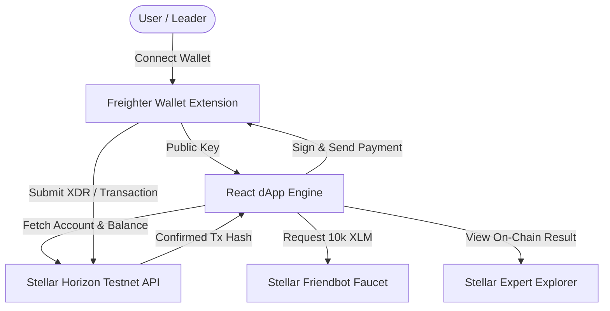

# 🌌 Stellar Contributor Recognition & Tipping Platform

<div align="center">


<p align="center">
  <b>A decentralized, transparent recognition & reward platform built on the Stellar Testnet.</b><br />
  Empowering open-source communities to motivate, tip, and appreciate contributors with instant, low-cost XLM micro-transactions.
</p>

</div>

---

## 📖 Overview

The **Stellar Contributor Recognition Platform** is designed for open-source project leads, DAOs, and developer communities to reward contributors for their impact, merged PRs, and verified code submissions. 

Built specifically for the **Stellar Monthly Builder Challenge (Level 1 - White Belt Submission)**, this dApp seamlessly integrates with the **Freighter Wallet** and the **Stellar Horizon Testnet REST API** to execute fast, secure, on-chain XLM payments with transparent transaction logging.

---

## ✨ Key Features & Level 1 Requirements

### 👛 1. Freighter Wallet Setup & Integration
- Native integration with the **Freighter Wallet** browser extension (`@stellar/freighter-api`).
- Configured specifically for **Stellar Testnet** (`Test SDF Network ; November 2015`).

### 🔌 2. Wallet Connection & Session Handling
- **One-Click Connect**: Connect your Freighter account and instantly display your public key (`G...`).
- **Disconnect**: Cleanly terminate session connection and state.
- **Address Masking**: Displays formatted address handles (e.g. `GAAZ...SKWW`) with a one-click copy button.

### 💰 3. Balance Querying & Friendbot Faucet
- **Real-Time XLM Balance**: Queries account balances live from the **Stellar Horizon REST API** (`https://horizon-testnet.stellar.org`).
- **Integrated Testnet Faucet**: Request **10,000 Testnet XLM** with a single click using the **Stellar Friendbot API** (`https://friendbot.stellar.org`).

### ⚡ 4. Transaction Flow & Live Feedback
- **Send XLM Payments/Tips**: Tip any valid Stellar public key or select a contributor from the community leaderboard.
- **Preset Quick-Amounts**: Send `5`, `10`, `25`, `50`, or `100` XLM with customizable transaction memos.
- **Real-Time Transaction Status**:
  - Success and Error state alerts.
  - Full 64-character transaction hash output.
  - Direct explorer verification links pointing to [Stellar Expert Testnet Explorer](https://stellar.expert/explorer/testnet/).

### 🏆 5. Contributor Leaderboard & Transaction History
- **Contributor Cards**: View open-source devs with their GitHub handles, roles, merged PR count, and accumulated tips.
- **Session History Log**: Real-time record of all sent XLM transactions with timestamp, memo, recipient address, and transaction status.

---

## 🏗️ Architecture & Data Flow



---

## 📸 Submission Screenshots Guide

| Level 1 Checklist Requirement | Visual Proof Component | Implementation Location | Status |
| :--- | :--- | :--- | :---: |
| **Public GitHub Repository** | Public repo cloned & pushed | `github.com/arpanbasak90-cyber/Contributor-Recognition-Platform` | ✅ Pass |
| **README.md Documentation** | Comprehensive project overview & guide | [README.md](file:///c:/Users/Admin/OneDrive/Desktop/Contributor%20Recognition%20Platform/README.md) | ✅ Pass |
| **Wallet Connected State** | Connected public key & network badge | `Header.tsx` & `WalletCard.tsx` | ✅ Pass |
| **Balance Displayed** | Live XLM account balance | `Header.tsx` & `WalletCard.tsx` | ✅ Pass |
| **Successful Testnet Transaction** | Transaction submitted to Testnet | `TippingForm.tsx` | ✅ Pass |
| **Transaction Result Shown** | Success banner, Hash & Explorer link | `TippingForm.tsx` & `TransactionHistory.tsx` | ✅ Pass |

---

## 💻 Local Installation & Setup

### Prerequisites
Make sure you have the following installed on your machine:
- **Node.js** (v18.0.0 or higher) & **npm**
- **Freighter Wallet Extension** ([Install for Chrome / Firefox / Brave](https://www.freighter.app/))

### 1. Clone the Repository
```bash
git clone https://github.com/arpanbasak90-cyber/Contributor-Recognition-Platform.git
cd Contributor-Recognition-Platform
```

### 2. Install Project Dependencies
```bash
npm install
```

### 3. Run Development Server
```bash
npm run dev
```
Open your browser and navigate to `http://localhost:3000`.

### 4. Build for Production
```bash
npm run build
```

---

## 📂 Project Structure

```
Contributor-Recognition-Platform/
├── src/
│   ├── components/
│   │   ├── Header.tsx             # Navigation header with wallet state & balance
│   │   ├── WalletCard.tsx         # Wallet info card, copy address & Friendbot faucet
│   │   ├── TippingForm.tsx        # XLM payment form, preset buttons & feedback alerts
│   │   ├── ContributorList.tsx    # Contributor leaderboard & quick-reward actions
│   │   └── TransactionHistory.tsx # Live on-chain transaction log feed
│   ├── services/
│   │   └── stellar.ts             # Freighter API, Horizon REST API & transaction logic
│   ├── styles/
│   │   └── index.css              # Custom glassmorphic dark design system
│   ├── App.tsx                    # Main app state & tab router
│   └── main.tsx                   # React DOM entry point
├── index.html                     # HTML shell & font imports
├── vite.config.ts                 # Vite bundler configuration
├── tsconfig.json                  # TypeScript compiler settings
├── package.json                   # Dependencies & scripts
└── README.md                      # Project documentation
```

---

## 🛠️ Tech Stack & Tools

- **Frontend Framework**: React 18 + TypeScript + Vite
- **Blockchain Network**: Stellar Testnet (`https://horizon-testnet.stellar.org`)
- **Wallet Provider**: Freighter API (`@stellar/freighter-api`)
- **Faucet Provider**: Stellar Friendbot (`https://friendbot.stellar.org`)
- **Icons & UI**: Lucide React + Glassmorphism Vanilla CSS

---

## 📜 License

Distributed under the **MIT License**. Built with ❤️ for the Stellar Community and RiseIn Monthly Builder Challenge.
